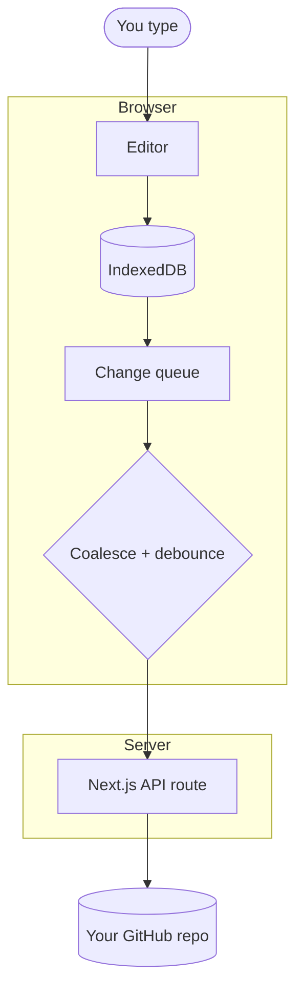

# ForkLeaf

**Notes that outlive the app that made them.**

A local-first Markdown workspace — linked notes, full-text search, a visual
Mermaid studio, exports — whose storage is a GitHub repository you already own.

[](https://github.com/praneeth132006/ForkLeaf/actions/workflows/ci.yml)
[](LICENSE)

Every note is a plain `.md` file in a repository you own. That means real version
history, effectively unlimited storage, access from anywhere, and the ability to
walk away at any time — clone the repo and every note is still there. There is no
ForkLeaf database to be locked out of.

Free, all of it, with no tiers. The expensive part of a notes app is storage, and
ForkLeaf has none.

---

## Contents

- [Why this exists](#why-this-exists)
- [Features](#features)
  - [Writing](#writing) · [Links](#links-between-notes) · [Search](#search) ·
    [Diagrams](#diagrams) · [Sync](#sync) · [History and review](#history-and-review) ·
    [Dashboard](#dashboard) · [Workspaces](#workspaces) ·
    [On your desktop](#on-your-desktop) · [Publishing](#publishing) ·
    [Exporting](#exporting) · [Keyboard](#keyboard)
- [Quick start](#quick-start)
- [How it works](#how-it-works)
- [Documentation](#documentation)
- [Development](#development)
- [Contributing](#contributing)

---

## Why this exists

Most note apps ask you to trust them with your writing. ForkLeaf doesn't hold
your notes at all:

|             |                                                                   |
| ----------- | ----------------------------------------------------------------- |
| **Storage** | Your GitHub repo. Nothing is stored on our servers.               |
| **History** | Ordinary git commits. `git log` your notes.                       |
| **Offline** | Everything is written to IndexedDB first, then pushed.            |
| **Export**  | PDF, HTML, Word, Markdown, plain text, JSON — all in the browser. |
| **Sharing** | A public page committed to your repo and served by GitHub Pages.  |
| **Lock-in** | None. They're markdown files in a git repo.                       |

## Features

### Writing

- **Three editing modes**, switchable per document: Notion-style rich text, a
  split source/preview view, and raw markdown.
- **Slash commands** (`/`) for headings, lists, tables, to-dos, code and diagrams.
- **Properties panel** that edits the note's YAML frontmatter directly, so notes
  stay compatible with Obsidian, Jekyll, Hugo and friends.
- **Command palette** (`⌘K`) — jump to any note by title, or run any editor
  command, without leaving the keyboard.
- Document outline, word count, reading time and task progress.

### Links between notes

- **`[[Wikilinks]]`**, in the Obsidian dialect — `[[target]]`,
  `[[target|call it this]]`, `[[target#a heading]]`. Plain text in the file, so
  Obsidian, github.com and anything else that reads markdown see them too.
- **Backlinks.** The document panel shows every note that links to the one
  you're reading, each quoting the line it was written on — so a backlink tells
  you _what_ was said about the note, not just that something was.
- **Links resolve loosely on purpose**: by path, by filename, or by title, so
  `[[q3-roadmap]]` and `[[Q3 roadmap]]` reach the same note.
- **Linking ahead of yourself is normal.** A link to a note you haven't written
  is drawn muted rather than broken, and clicking it writes the note.

### Search

- **Full text.** Every word of every note, ranked with BM25 — not just titles,
  tags and filenames. Results quote the line that matched, with the matching
  words marked.
- Titles and tags are weighted above body text, so the note _about_ a thing
  beats the note that mentions it once.
- **`"Quoted phrases"`** must appear verbatim. Everything else is an AND search,
  because "300 of your notes contain one of your words" answers nothing.
- Runs entirely in the browser against the notes already on your machine. No
  server, no index to rebuild, works offline.

### Diagrams

Mermaid is powerful and hard to remember, so there are three ways in:

- **Pick what you are drawing** — a new diagram asks first, then hands over a
  blank canvas carrying that type's own shapes, arrows and syntax.
- **Visual builder** — drag shapes onto a canvas, pull arrows between them, and
  the Mermaid source is generated for you. Six types can be drawn rather than
  typed: flowchart, sequence, class, state machine, ERD and mindmap. Rubber-band
  selection, multi-node drag, undo/redo, keyboard nudge and a "tidy up" that
  lays the graph out in layers taken from its own arrows. It parses existing
  diagrams too, so you can switch between visual and source freely.
- **Template gallery** — 14 ready-made diagrams (flowchart, sequence, ERD, gantt,
  state machine, mind map, class, pie, journey, timeline, git graph, quadrant).
- **Smart source editor** — autocomplete that knows which diagram type you're
  writing, plus inline errors that point at the broken line and explain it in
  plain language instead of dumping parser output.

- **Open in tab** — optional, for the diagrams that outgrow a dialog. The same
  studio opens in a browser tab of its own, for a second screen or a full-height
  canvas, and every edit is saved into the note as you make it. The note stays
  the one writer: the block shows "Editing in another tab" with a link that
  takes editing back, and clicking a diagram still opens it in the note.

Diagrams are drawn in the app's own palette and follow the light/dark theme,
including in that separate tab. They are stored as normal ` ```mermaid ` fenced
blocks, so they render on github.com and anywhere else Mermaid is supported.

### Sync

- **Local-first.** Edits land in IndexedDB immediately; the network is never in
  the way of typing.
- **Clean git history.** Rapid edits to one note coalesce into a single pending
  change, and a commit made within the last few minutes is amended rather than
  stacked — so autosave doesn't produce a thousand "update note.md" commits.
- **Offline-safe.** Changes queue while you're offline and drain when you
  reconnect. Closing the tab loses nothing.
- **Conflict handling.** If a note changed both here and on GitHub, you're asked
  what to keep — nothing is silently overwritten.
- **Tabs cooperate.** A second ForkLeaf tab used to be able to hold local
  storage hostage across an upgrade, leaving the other one on a loading screen
  for eight seconds before telling you to go and close it. They talk to each
  other now: the blocked tab asks, the others let go, and it clears in
  milliseconds.

### History and review

- **Every version of every note**, read from the repository's own commit log and
  shown in the app with a diff — no separate "version history" feature, because
  git already is one.
- **Branches.** Switch the branch you are writing on from the status bar; notes
  are read from and committed to that branch.
- **Propose changes.** For a repository you cannot push to, ForkLeaf forks it,
  commits to a branch and opens a pull request — so contributing a documentation
  fix is the same gesture as editing a note.

### Dashboard

- Signing in lands on a **dashboard**, not an empty editor: every note across
  every connected repository, indexed by title, tag and folder rather than
  filename, and searchable — text and all — from one box.
- Recently edited notes, per-repository statistics, and one click into any note.

### Workspaces

- **You choose where your notes live.** On first sign-in ForkLeaf asks: connect a
  repository you already have, optionally scoped to a subfolder like `docs/`, or
  create a new one. Nothing is created on your account without you asking.
- Connect as many repositories as you like and switch between them.

### On your desktop

ForkLeaf installs as an app and registers itself with your operating system as
a Markdown editor — like gedit, TextEdit or any other installed editor:

- **`xdg-open note.md` opens it**, and so does double-clicking a `.md` file or
  picking ForkLeaf from "Open with".
- **⌘S writes that file.** A file opened from your machine becomes a normal
  note — synced, searchable, in the sidebar — that also saves back to where it
  came from. Not to a copy in `~/Downloads`.
- **⇧⌘S is Save as**, and `⌘K → "Open a file from this computer"` is the
  in-app route to the same thing.

Install it from your browser's address bar (the install icon), then on Linux:

```bash
./desktop/install-linux.sh
xdg-mime default forkleaf.desktop text/markdown
```

That puts a launcher, an icon and a `.desktop` entry under `~/.local` — no root,
and `./desktop/install-linux.sh --uninstall` removes them. Editing files on your
machine uses the File System Access API, which today means a Chromium-based
browser; everything else in ForkLeaf works everywhere.

### Publishing

**Share this note** renders it to one self-contained page — diagrams included —
commits it to `docs/` in the repository the note already lives in, and switches
on GitHub Pages. You get a public link.

Nothing is stored on our servers, hosting costs nothing, and unpublishing is a
commit that deletes a file. A published note keeps working if ForkLeaf goes
away, which is the only kind of sharing worth having in an app that promises no
lock-in.

### Exporting

Six formats, all rendered in the browser — the note never leaves your machine in
order to become a file:

| Format         | What you get                                     |
| -------------- | ------------------------------------------------ |
| **PDF**        | Typeset for printing, diagrams included          |
| **Word**       | Editable `.docx` with real headings and lists    |
| **HTML**       | One self-contained file, nothing to host         |
| **Markdown**   | The original source, with or without frontmatter |
| **Plain text** | Formatting stripped away                         |
| **JSON**       | Content, properties and statistics               |

Export one note, or the whole workspace at once.

### Keyboard

| Shortcut | Does                                                 |
| -------- | ---------------------------------------------------- |
| `⌘K`     | Search every note, or run any command                |
| `/`      | Insert a block — heading, list, table, code, diagram |
| `⌘S`     | Save now rather than waiting for autosave            |
| `⌘⇧N`    | New note                                             |
| `⌘⇧E`    | Export                                               |
| `⌘⇧?`    | Help and the full shortcut list                      |

The complete table, including the rich-text and source-mode bindings, is on the
`/docs/shortcuts` page of the app itself, and behind `⌘⇧?` while you are writing.

### Themes

Light and dark, following the system by default, with a choice of accent colour.
Every surface in the app reads from the same set of semantic tokens, so the
choice applies everywhere at once.

---

## Quick start

### Try it without any setup

```bash
git clone https://github.com/praneeth132006/ForkLeaf.git
cd ForkLeaf
pnpm install
pnpm dev
```

Open <http://localhost:3000/editor>. With no configuration, ForkLeaf runs in
**local mode**: fully functional, with notes stored in your browser. This is also
how the test suite and CI exercise the app.

**Requirements:** Node.js 20.9+ and pnpm 9+.

### Connect GitHub

To sync notes to a repository, register a GitHub OAuth app and add three
environment variables.

1. Go to **GitHub → Settings → Developer settings → OAuth Apps → New OAuth App**.
2. Set:
   - **Homepage URL**: `http://localhost:3000`
   - **Authorization callback URL**: `http://localhost:3000/api/auth/callback`
3. Copy `.env.example` to `apps/web/.env.local` and fill it in:

```bash
cp .env.example apps/web/.env.local
```

```ini
GITHUB_OAUTH_CLIENT_ID=your_client_id
GITHUB_OAUTH_CLIENT_SECRET=your_client_secret
SESSION_SECRET=generate_with_openssl_rand_base64_32
NEXT_PUBLIC_APP_URL=http://localhost:3000
```

Generate the session secret with:

```bash
openssl rand -base64 32
```

Restart `pnpm dev` and "Continue with GitHub" will appear.

> **On the `repo` scope:** ForkLeaf requests `repo` because it writes notes to
> your private repositories, and that is the narrowest classic OAuth scope that
> permits private-repo writes. If you'd rather grant access to one repository
> only, see [docs/self-hosting.md](docs/self-hosting.md) for the GitHub App route.

---

## How it works



The access token lives only on the server, encrypted into an httpOnly cookie.
The browser talks to `/api/gh/*`, never to GitHub directly — so no script on the
page can read your token.

### Packages

| Package                     | Responsibility                                                         |
| --------------------------- | ---------------------------------------------------------------------- |
| `@forkleaf/types`           | Shared domain model                                                    |
| `@forkleaf/markdown-engine` | Frontmatter, parsing, sanitised rendering, wikilinks, path helpers     |
| `@forkleaf/github-client`   | GitHub REST client: trees, files, atomic multi-file commits, squashing |
| `@forkleaf/store`           | IndexedDB storage, change queue, sync engine, conflicts, search index  |
| `@forkleaf/diagrams`        | Mermaid rendering, templates, autocomplete, visual-builder graph model |
| `@forkleaf/exporter`        | Client-side PDF / HTML / DOCX / Markdown / ZIP export                  |
| `@forkleaf/editor`          | React editing surfaces (rich text, source, split, diagram studio)      |
| `@forkleaf/web`             | Next.js app: auth, API routes, publishing, application shell           |

More detail in [docs/architecture.md](docs/architecture.md).

---

## Documentation

The app ships its own documentation site at `/docs`, covering every page below.
Run `pnpm dev` and open <http://localhost:3000/docs>, or read it on the hosted
instance.

| Section             | Pages                                                      |
| ------------------- | ---------------------------------------------------------- |
| Start here          | Getting started · How ForkLeaf works                       |
| Writing             | The editor · Diagrams · Properties · Exporting · Shortcuts |
| GitHub              | Signing in · Repositories · Syncing · Conflicts            |
| Account             | What it costs · Your data · Security model                 |
| Running it yourself | Self-hosting · Firebase setup · Troubleshooting · FAQ      |

Architecture notes live in [docs/architecture.md](docs/architecture.md), and the
deployment guide in [docs/self-hosting.md](docs/self-hosting.md).

---

## Development

```bash
pnpm dev          # start the web app
pnpm test         # run the test suite
pnpm typecheck    # typecheck every package
pnpm lint         # lint
pnpm build        # production build
pnpm check        # everything above, in order
```

Workspace packages ship TypeScript source and are compiled by Next via
`transpilePackages`. There is no build step between packages, so edits hot-reload
across the monorepo.

---

## Contributing

Contributions are very welcome — see [CONTRIBUTING.md](CONTRIBUTING.md) for the
setup, conventions and a list of good first issues.

Found a security issue? Please read [SECURITY.md](SECURITY.md) rather than
opening a public issue.

## License

[Apache License 2.0](LICENSE).
