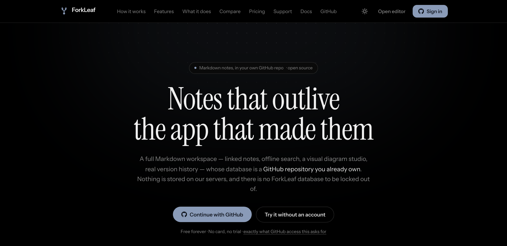
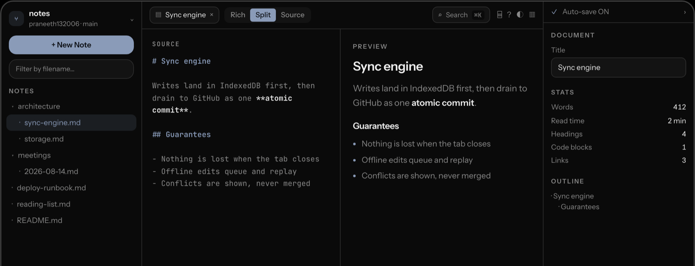
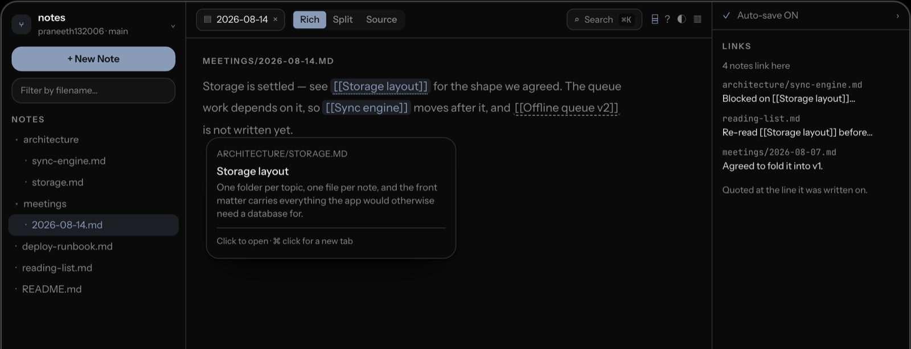
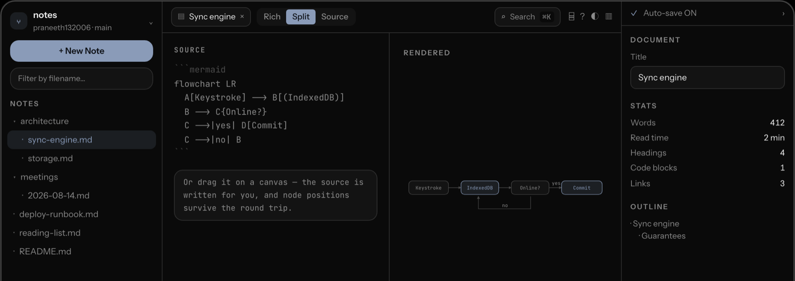
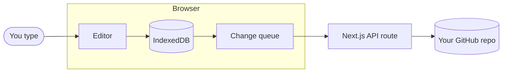

<div align="center">

<a href="https://www.forkleaf.in">
  <picture>
    <source media="(prefers-color-scheme: dark)" srcset="apps/web/public/brand/forkleaf-logo.svg">
    
  </picture>
</a>

### Notes that outlive the app that made them.

A full Markdown workspace whose database is a **GitHub repository you already own**.<br>
Linked notes, offline search, a visual diagram studio and real version history,<br>
with nothing stored on our servers and nothing to be locked out of.

[](https://github.com/praneeth132006/ForkLeaf/actions/workflows/ci.yml)
[](LICENSE)
[](https://github.com/praneeth132006/ForkLeaf/stargazers)
[](https://github.com/praneeth132006/ForkLeaf/discussions)
[](CONTRIBUTING.md)

**[Open ForkLeaf](https://www.forkleaf.in)** ·
[Try it without an account](https://www.forkleaf.in/editor) ·
[Documentation](https://www.forkleaf.in/docs) ·
[Discussions](https://github.com/praneeth132006/ForkLeaf/discussions) ·
[Wiki](https://github.com/praneeth132006/ForkLeaf/wiki) ·
[Changelog](CHANGELOG.md)

<br>

<a href="https://www.forkleaf.in"></a>

</div>

---

## Why ForkLeaf?

Most note apps ask you to trust them with your writing. ForkLeaf doesn't hold your
notes at all. Every note is a plain `.md` file in a GitHub repository you own.

|                   |                                                                     |
| ----------------- | ------------------------------------------------------------------- |
| 🗂 **Storage**     | Your GitHub repository. Nothing is stored on our servers.           |
| 🕰 **History**     | Ordinary git commits. `git log` your notes, blame a paragraph.      |
| ✈️ **Offline**    | Everything is written to IndexedDB first, then pushed.              |
| 📤 **Export**     | PDF, HTML, Word, Markdown, plain text and JSON, all in the browser. |
| 🌐 **Publishing** | Public pages, books and digital gardens served by GitHub Pages.     |
| 🔓 **Lock-in**    | None. Clone the repository and every note is still there.           |

**Free, all of it, with no tiers.** The expensive part of a notes app is storage,
and ForkLeaf has none.

## Features

<table>
<tr>
<td width="50%" valign="top">

### ✍️ Write the way you like

Rich text, split source and preview, or raw Markdown, switchable per note.
Slash commands, a `⌘K` command palette, a properties panel that edits YAML
frontmatter, and live stats and outline for every note.

</td>
<td width="50%"></td>
</tr>
<tr>
<td width="50%"></td>
<td width="50%" valign="top">

### 🔗 Notes that link to each other

`[[Wikilinks]]` in the Obsidian dialect, with hover previews, backlinks quoted at
the line they were written on, and links to notes you haven't written yet.
Full-text search ranks every word of every note, offline.

</td>
</tr>
<tr>
<td width="50%" valign="top">

### 📊 A real diagram studio

Mermaid diagrams drawn on a canvas or typed with autocomplete. A gallery of
14 templates, and node positions that survive the round trip between the
visual builder and the source.

</td>
<td width="50%"></td>
</tr>
</table>

**And much more:**

- 📄 **Read PDFs beside your notes.** Quote a passage and the citation records the sentence, not the page number.
- 🔄 **Local-first sync.** Rapid edits coalesce into one clean commit. Offline changes queue up, and conflicts are shown, never silently merged.
- 🕵️ **History and review.** Every version of every note, blame for prose, a timeline replay of how your notebook grew, and spaced reading.
- 🌿 **Branches and pull requests.** Write on any branch, or propose changes to a repository you can't push to.
- 🌍 **Publish** a note, a book or a digital garden to GitHub Pages, with backlinks and a link map.
- 🧩 **Browser extension.** Save pages, selections and highlights from anywhere on the web to your inbox.
- 🤖 **AI assistants.** A built-in [MCP server](packages/mcp) lets Claude and other assistants search, read and write your notes as ordinary commits.
- 🎨 **Themes**, keyboard shortcuts for everything, and installable as an app on desktop.

See the full list on the [features page](https://www.forkleaf.in/features) or in [features.md](features.md).

## Getting started

### Use it online

1. Go to **[www.forkleaf.in](https://www.forkleaf.in)** and click **Continue with GitHub**.
2. Pick an existing repository or let ForkLeaf create a private one for you.
3. Start writing. Every change is saved to your repository as a commit.

You can also **[try it without an account](https://www.forkleaf.in/editor)**:
notes stay in your browser until you connect GitHub.

### Run it locally

**Requirements:** Node.js 20.9+ and pnpm 9+.

```bash
git clone https://github.com/praneeth132006/ForkLeaf.git
cd ForkLeaf
pnpm install
pnpm dev
```

Open <http://localhost:3000/editor>. With no configuration, ForkLeaf runs in
**local mode**: fully functional, with notes stored in your browser. This is also
how the test suite and CI exercise the app.

<details>
<summary><b>Connect GitHub while developing</b></summary>

<br>

1. Go to **GitHub → Settings → Developer settings → OAuth Apps → New OAuth App** and set:
   - **Homepage URL:** `http://localhost:3000`
   - **Authorization callback URL:** `http://localhost:3000/api/auth/callback`
2. Copy the example environment file and fill in your app's values:

   ```bash
   cp .env.example apps/web/.env.local
   ```

   ```ini
   GITHUB_OAUTH_CLIENT_ID=your_client_id
   GITHUB_OAUTH_CLIENT_SECRET=your_client_secret
   SESSION_SECRET=generate_with_openssl_rand_base64_32
   NEXT_PUBLIC_APP_URL=http://localhost:3000
   ```

3. Generate the session secret with `openssl rand -base64 32`, then restart `pnpm dev`.

ForkLeaf requests the `repo` scope because it writes to private repositories;
`public_repo` is offered on the sign-in page for anyone keeping notes in public
repositories only.

</details>

## How it works


```mermaid
flowchart LR
    You([You type]) --> Editor
    Editor --> Store[(IndexedDB)]
    Store --> Queue[Change queue]
    Queue --> API[Next.js API route]
    API --> GH[(Your GitHub repo)]

    subgraph Browser
        Editor
        Store
        Queue
    end
```

Your GitHub token lives only on the server, encrypted into an httpOnly cookie. The
browser talks to `/api/gh/*`, never to GitHub directly, so no script on the page
can read your token. More in [docs/architecture.md](docs/architecture.md).

### Repository layout

This is a pnpm + Turborepo monorepo.

| Package                     | Responsibility                                                          |
| --------------------------- | ----------------------------------------------------------------------- |
| `apps/web`                  | Next.js app: auth, API routes, publishing, the editor shell and docs    |
| `apps/extension`            | The "Save to ForkLeaf" browser extension                                |
| `@forkleaf/editor`          | React editing surfaces: rich text, source, split and the diagram studio |
| `@forkleaf/store`           | IndexedDB storage, change queue, sync engine, conflicts, search index   |
| `@forkleaf/github-client`   | GitHub REST client: trees, files, atomic multi-file commits             |
| `@forkleaf/markdown-engine` | Frontmatter, parsing, sanitised rendering, wikilinks                    |
| `@forkleaf/diagrams`        | Mermaid rendering, templates, autocomplete, visual-builder graph model  |
| `@forkleaf/exporter`        | Client-side PDF, HTML, DOCX, Markdown and ZIP export                    |
| `@forkleaf/pdf`             | PDF text extraction, in-document search, durable citations              |
| `@forkleaf/mcp`             | MCP server for AI assistants                                            |
| `@forkleaf/types`           | Shared domain model                                                     |

### Development

```bash
pnpm dev          # start the web app
pnpm test         # run the test suite
pnpm typecheck    # typecheck every package
pnpm lint         # lint
pnpm build        # production build
pnpm check        # everything above, in order (run this before a pull request)
```

## Community

- 💬 **[Discussions](https://github.com/praneeth132006/ForkLeaf/discussions):** questions, ideas and showing what you've built.
- 🐛 **[Issues](https://github.com/praneeth132006/ForkLeaf/issues/new/choose):** bug reports and feature requests.
- 📚 **[Wiki](https://github.com/praneeth132006/ForkLeaf/wiki):** guides, FAQ and recipes from the community.
- ✉️ **Email:** [support@forkleaf.in](mailto:support@forkleaf.in) for anything private. Replies sometimes land in spam, so check there if you haven't heard back.

## Contributing

Contributions of every size are welcome, from a typo fix to a new feature. Read
[CONTRIBUTING.md](CONTRIBUTING.md) for setup, conventions and good first issues,
and please follow the [Code of Conduct](CODE_OF_CONDUCT.md).

Found a security issue? Please don't open a public issue. See [SECURITY.md](SECURITY.md).

If ForkLeaf is useful to you, a ⭐ on the repository helps other people find it.

## License

[Apache License 2.0](LICENSE) © ForkLeaf contributors.
