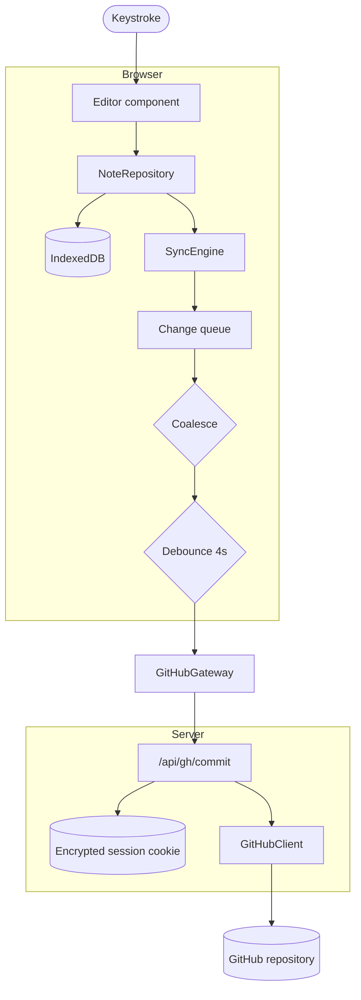

# Architecture

How ForkLeaf is put together, and why.

## The core idea

There is no ForkLeaf database. Notes are markdown files in the user's own GitHub
repository, and the app is a client for that repository plus a local cache.

Everything else follows from that constraint:

- **Storage is the user's problem, in a good way.** No hosting costs, no quotas,
  no migration, no "export my data" feature to build — the data was never ours.
- **Version history is free.** Git already does this better than an app-level
  revision system would.
- **The app must work offline**, because a note app that needs the network to
  accept a keystroke is not usable.
- **Commit history must stay readable**, because it is a real repository the
  user will look at.

## Data flow



The important property: the path from keystroke to durable storage is
`Editor → Repository → IndexedDB` and nothing else. The network is downstream of
that, always.

## Packages

### `@forkleaf/types`

The shared domain model. Everything is plain serialisable data — no classes, no
`Date` objects — because these values travel through `structuredClone` into
IndexedDB and across the network.

### `@forkleaf/markdown-engine`

Frontmatter parsing, document analysis and sanitised rendering.

Frontmatter is parsed by hand rather than with gray-matter: gray-matter pulls in
Node's `Buffer` and a much larger YAML stack, and this parser runs in the browser
on every keystroke. Malformed YAML is never fatal — the raw text is kept as the
body so a broken property block can't destroy a note.

`render.ts` is a **security boundary**. Note content can come from any public
repository, so it is untrusted: raw HTML is escaped rather than rendered, and the
sanitiser uses an explicit allowlist.

### `@forkleaf/github-client`

A hand-written GitHub REST client rather than Octokit. That choice buys explicit
control over the three behaviours the sync engine depends on:

1. **Conditional requests.** Tree listings send `If-None-Match`, so polling for
   remote changes costs no rate-limit quota.
2. **Rate-limit handling.** 403s are separated into permission denials and rate
   limits, with backoff driven by `retry-after` / `x-ratelimit-reset`.
3. **Atomic multi-file commits.** Writes go through the git data API
   (blob → tree → commit → ref), not the contents API, which can only touch one
   file per commit.

It also makes the client trivially testable with an injected `fetch`.

#### Commit squashing

Autosave naturally produces a commit per save, which would make the repository's
history useless. Two mechanisms prevent that:

1. **Coalescing** (in the store): repeated edits to one note collapse into a
   single pending change before anything is sent.
2. **Squashing** (here): if the branch head is a commit ForkLeaf made recently,
   the new commit adopts that commit's _parent_ while keeping its _tree_, and the
   ref is force-updated. The two commits collapse into one, and nothing the older
   commit introduced is lost.

Force-updating a ref is dangerous, so it is fenced in:

- only when the head commit's message carries ForkLeaf's marker
- only within the configured window (default 5 minutes)
- never when the head commit has zero or multiple parents
- the branch head is re-read immediately before the push; if it moved, the whole
  operation falls back to an ordinary commit

Every one of those conditions has a test in `client.test.ts`.

### `@forkleaf/store`

Local-first storage and sync.

The engine depends on two **ports** — `LocalDatabase` and `RemoteGateway` — rather
than concrete implementations. That's what lets the entire sync engine be tested
in Node against in-memory fakes, and it is why `LocalGateway` can make the whole
app run with no GitHub account at all.

Key behaviours:

- **Coalescing rules** (`queue.ts`) are pure functions: repeated edits collapse;
  a note created and deleted before syncing never reaches GitHub; a rename of a
  never-synced note becomes a plain create; chained renames collapse to one move.
- **The original base SHA is preserved** across coalesced edits. Adopting a newer
  SHA would silently mask a remote edit that landed while the user was typing.
- **Conflicts** are detected by comparing the remote blob SHA against the SHA the
  edit was based on. On a mismatch the change is held back and the user chooses:
  keep local (rebase onto the remote SHA), keep remote, or keep both.
- **Failures are counted.** A change that can never succeed (revoked token,
  deleted repo) is dropped after five attempts rather than blocking the queue
  behind it forever.

### `@forkleaf/diagrams`

Mermaid support, split into pure logic and rendering.

`graph-model.ts` is the interesting part: a bidirectional mapping between Mermaid
flowchart source and a `{nodes, edges}` graph. The visual builder edits the graph;
the source editor edits the text; both stay in sync because the mapping round
trips. Node positions are stored in a `%% forkleaf:layout` comment, which Mermaid
ignores and GitHub renders fine.

The parser is deliberately forgiving — it runs against half-typed source as the
user works, so unrecognised lines are skipped rather than throwing.

### `@forkleaf/exporter`

Everything is generated in the browser. No upload, no conversion service, no
per-export cost, and a private note stays on the machine.

- **HTML/PDF**: markdown → sanitised HTML with diagrams spliced in as SVG. PDF
  goes through the browser's own print pipeline, which is the only way to get
  real selectable text without shipping a rendering engine.
- **DOCX**: walks the mdast tree rather than converting HTML, so headings become
  real Word heading styles and lists become real Word lists.

### `@forkleaf/editor`

React editing surfaces. Built directly on CodeMirror 6 rather than a React
wrapper, because wrappers that replace the whole document on every prop change
destroy the cursor position and undo history — unusable in an autosaving editor.

Diagrams are stored as ordinary ` ```mermaid ` fenced blocks. The Tiptap node
serialises to a fence and, crucially, parses fences back into diagram nodes — so
reopening a note doesn't downgrade its diagrams to code blocks, and a note
written here renders correctly on github.com.

### `@forkleaf/web`

The Next.js app: OAuth, the GitHub proxy routes, and the application shell.

The token never reaches the browser. It is encrypted into an httpOnly cookie and
every GitHub call is proxied through `/api/gh/*`. See [SECURITY.md](../SECURITY.md).

## Testing strategy

Tests target logic where a bug means lost data or a security hole:

| Area              | What's covered                                                                                                 |
| ----------------- | -------------------------------------------------------------------------------------------------------------- |
| `github-client`   | Commit ordering, batching, renames, every squash guard, error classification, base64 round-trip                |
| `store`           | Coalescing rules, debouncing, offline queueing, restart recovery, all three conflict resolutions, retry limits |
| `markdown-engine` | Frontmatter edge cases (CRLF, broken YAML, `---` rules), XSS vectors, path traversal                           |
| `diagrams`        | Mermaid ⇄ graph round trip for every shape and edge style, template validity, error messages                   |

UI components are verified by hand and by the production build. The tests that
exist are the ones worth maintaining.

## Deliberate non-goals

- **Real-time collaborative editing.** It needs an always-on server, and it
  conflicts with git-based versioning. GitHub already provides collaboration
  through branches and pull requests.
- **A hosted storage tier.** The entire premise is that we don't hold your notes.
- **Server-side export.** It costs money to run and, done carelessly (shelling
  out to pandoc with `--pdf-engine=xelatex` on user input), is a remote-code-
  execution hazard.
